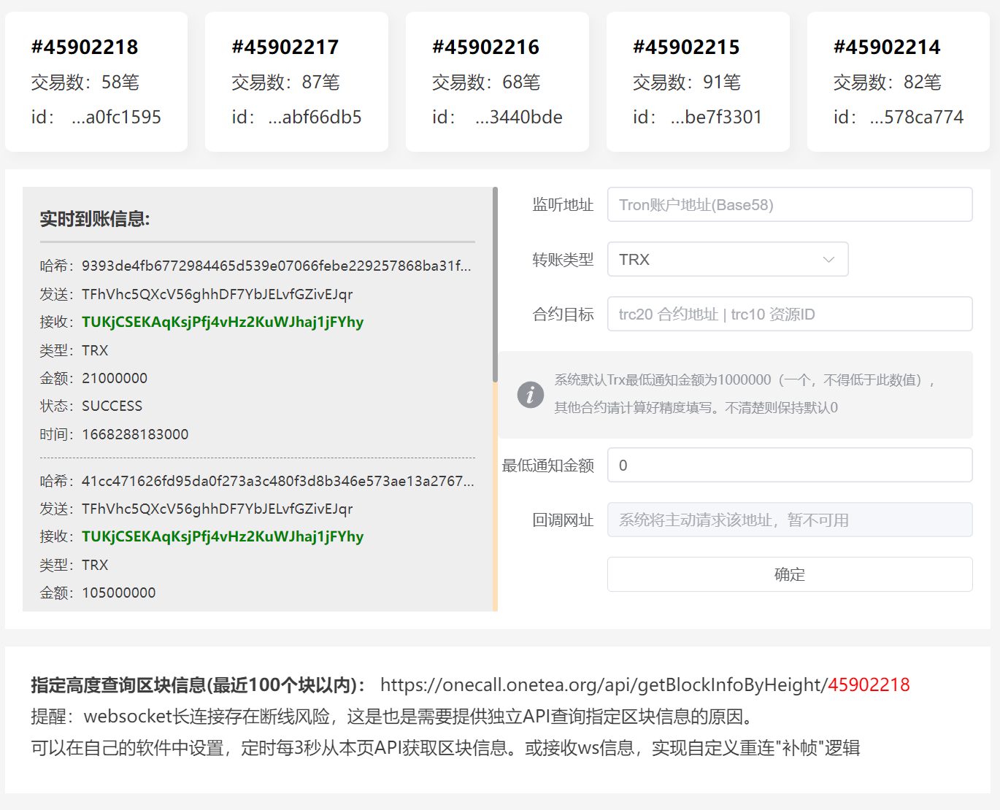

# OneCall 后端

EasyTron 的简单实践，功能：

1.实时同步最新区块，并通过ws广播给所有监听用户

2.实现对某一个地址进行 trc20 、 trx的实时转账监听

要扩展trc10监听只需要在Spring容器中添加 trx 转账处理器，十分简单。

---

Tron区块链依赖：[EasyTron](https://github.com/Aiden-777/EasyTron)、[trident](https://github.com/tronprotocol/trident)

需要额外服务：redis - 缓存最近区块信息

运行前请在 application.yml 配置 [apiKey](https://cn.developers.tron.network/reference/apikey)

前端仓库：https://github.com/Aiden-777/onecall-vue



---

订阅 /block-header 返回数据：

```JSON
{
  "id": "0000000001b1f0732a5a0457c810bbfccabe255d5ce603999e8dee47518af2ab",
  "height": 28438643,
  "count": 2
}
```

订阅 /block 返回数据：

```JSON
{
  "header": {
    "id": "0000000001b1f0732a5a0457c810bbfccabe255d5ce603999e8dee47518af2ab",
    "height": 28438643,
    "count": 3
  },
  "transfers": [
    {
      "id": "3c46a213a4e6e760e01dccb23e58585663d29de633319316ca8449ce850d8bba",
      "transferType": "TRX",
      "from": "TMEZm1EJSm7uDUQjRE48YSmdhwxGNo1111",
      "to": "TMMWLNUUaSnAiif7KY8fPBxyR9wyaF8222",
      "amount": "36200",
      "status": "SUCCESS"
    },
    {
      "id": "fb3d46d87d26d5fb7a96ccca0e7c70bc52942345150f9183754654db4aede1d0",
      "transferType": "TRC20",
      "contractAddress": "TR7NHqjeKQxGTCi8q8ZY4pL8otSzgjLj6t",
      "from": "TBB3jfSew1ygkwhFf4Fjqq3LLSys77777P",
      "to": "TH33333nekHyQkBmxGhUPQjyBcCY3J1ceK",
      "amount": "1000000",
      "status": "SUCCESS"
    },
    {
      "id": "fb3d46d87d26d5fb7a96ccca0e7c70bc52942345150f9183754654db4aede1d0",
      "transferType": "TRC10",
      "assetName": "564826",
      "from": "TBB3jfSew1ygkwhFf4Fjqq3LLSys77777P",
      "to": "TH33333nekHyQkBmxGhUPQjyBcCY3J1ceK",
      "amount": "1000000",
      "status": "SUCCESS"
    }
  ]
}
```

---


Donate：TTTTTtczA5UZM65QJpncXUsH8KwgJTHyXw